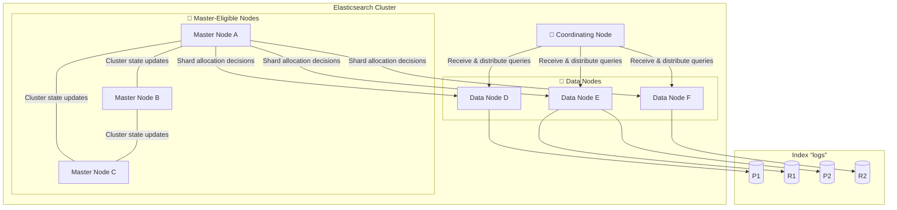

```mermaid
flowchart TB
  subgraph Cluster["Elasticsearch Cluster"]
    direction TB
    CN[🔀 Coordinating Node]
    subgraph Master_Nodes["👑 Master-Eligible Nodes"]
      M1[Master Node A]
      M2[Master Node B]
      M3[Master Node C]
    end
    subgraph Data_Nodes["💾 Data Nodes"]
      D1[Data Node D]
      D2[Data Node E]
      D3[Data Node F]
    end
  end

  %% Query flow
  CN -->|Receive & distribute queries| D1
  CN -->|Receive & distribute queries| D2
  CN -->|Receive & distribute queries| D3

  %% Cluster state propagation
  M1 ---|Cluster state updates| M2
  M1 ---|Cluster state updates| M3
  M2 ---|Cluster state updates| M3
  M1 -->|Shard allocation decisions| D1
  M1 -->|Shard allocation decisions| D2
  M1 -->|Shard allocation decisions| D3

  %% Example Shards
  subgraph Index_A["Index “logs”"]
    direction LR
    P1[(P1)]
    R1[(R1)]
    P2[(P2)]
    R2[(R2)]
  end

  D1 --> P1
  D2 --> R1
  D2 --> P2
  D3 --> R2
```
